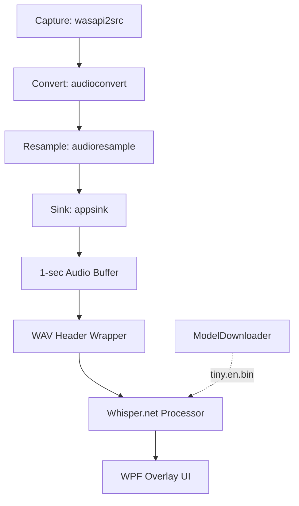

# Live Transcription App

A real-time speech-to-text overlay for Windows using OpenAI Whisper and GStreamer.

## 🚀 Overview

Captures microphone audio in real-time, transcribes it using the Whisper (`tiny.en`) model, and displays the result in a semi-transparent, always-on-top overlay window pinned across all virtual desktops.

## 🏗 Architecture



### Core Components

1. **Audio Pipeline (GStreamer)**
   - Captures audio via `wasapi2src` (Windows Audio Session API).
   - Pipeline: `wasapi2src ! audioconvert ! audioresample ! appsink`
   - Resamples to **16kHz Mono 16-bit PCM** (required by Whisper).
   - Audio is **buffered for ~1 second** before processing to improve accuracy.
   - Raw PCM is **wrapped with a WAV/RIFF header** before feeding to Whisper.

2. **Transcription Engine (Whisper.net)**
   - Uses `whisper.cpp` under the hood via the `Whisper.net` NuGet package.
   - Default model: **`tiny.en`** (~74 MB, fast and English-only).
   - `ModelDownloader` automatically downloads the model on first run.

3. **WPF Overlay UI**
   - Borderless, semi-transparent, always-on-top overlay window.
   - Built in **pure C# (no XAML)** to avoid `MC3074` build-time errors.
   - Positioned at the **bottom of the primary monitor** automatically.
   - **Pinned to all virtual desktops** using the Windows `IVirtualDesktopManager` COM API.
   - Includes a drag handle and close/settings buttons.

## 🛠 Tech Stack

| Component       | Technology                          |
|-----------------|-------------------------------------|
| Framework       | .NET 8.0 (net8.0-windows, win-x64)  |
| UI              | WPF (Windows Presentation Foundation)|
| Audio Capture   | GStreamer 1.x via `GstSharpBundle`  |
| Speech-to-Text  | Whisper.net 1.7.0 (`whisper.cpp`)   |
| Build System    | GNU Make + dotnet CLI               |

## 📦 Prerequisites

1. **[.NET 8.0 SDK](https://dotnet.microsoft.com/download/dotnet/8.0)**
2. **GStreamer Runtime** — Install via winget:
   ```bash
   winget install gstreamerproject.gstreamer
   ```
   Then add to your system `PATH`:
   ```
   C:\Program Files\gstreamer\1.0\msvc_x86_64\bin
   ```
   Verify installation:
   ```bash
   gst-inspect-1.0 --version
   gst-inspect-1.0 wasapi2src
   ```

## 🔨 Build & Run

```bash
# Build
make build

# Run (downloads tiny.en model on first launch, ~74 MB)
make run

# Clean build artifacts
make clean

# Full rebuild from scratch
make full-rebuild
```

### Manual Commands
```bash
dotnet restore -r win-x64
dotnet build -r win-x64
dotnet run --no-build -r win-x64
```

## 📝 Troubleshooting & Notes

- **First launch**: The `tiny.en` Whisper model (~74 MB) is downloaded automatically.
- **GStreamer path**: Detected automatically at `C:\Program Files\gstreamer\1.0\msvc_x86_64\bin`. `GST_PLUGIN_PATH` and `GST_PLUGIN_PATH_1_0` are also set automatically at startup.
- **Virtual desktops**: The window stays visible across all Windows virtual desktops (Win+Tab).
- **Startup diagnostics**: A `crash_log.txt` is written to the app directory if a fatal error occurs at startup.
- **WPF Build Errors**: The project explicitly sets `<UseWindowsForms>false</UseWindowsForms>` (by default) and uses pure C# UI code to prevent WPF/WinForms namespace ambiguities and `MC3074` XAML errors.

## 🐛 GStreamer Debugging Guide

If you encounter issues with audio not being captured or transcribed:

1. **Test Pipeline via CLI**
   Use `gst-launch-1.0` to verify audio is being captured by your system:
   ```bash
   # Test microphone capture
   gst-launch-1.0 wasapi2src num-buffers=100 ! fakesink dump=true
   
   # Test system audio (loopback) capture
   gst-launch-1.0 wasapi2src loopback=true num-buffers=100 ! fakesink dump=true
   ```

2. **Inspect Element Properties**
   Use `gst-inspect-1.0` to see all available properties for a GStreamer element:
   ```bash
   gst-inspect-1.0 wasapi2src
   ```

3. **Common Audio Capture Issues**
   - **No System Audio:** By default, `wasapi2src` captures the default microphone. To capture speaker output (what you hear), you must set the `loopback=true` property on the `wasapi2src` element.
   - **OverflowExceptions in PCM Processing:** When processing 16-bit PCM audio data (S16LE), taking the absolute value of `short.MinValue` (-32768) will cause an `OverflowException` because the maximum positive `short` is `32767`. Always cast to `int` before calling `Math.Abs()`.
   - **Pipeline State:** If samples are not arriving, check the return value of `_pipeline.SetState(State.Playing)`. It should return `StateChangeReturn.Success` or `StateChangeReturn.Async`.
