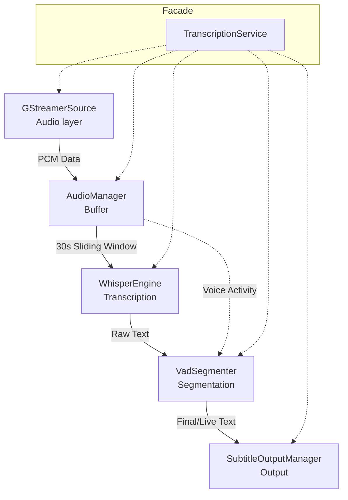

# Live Captions

A real-time system audio transcription overlay for Windows, built with .NET 8, Whisper.net, and GStreamer.

## Features

- Captures system audio (speaker loopback) in real-time via GStreamer
- Transcribes using OpenAI Whisper (`tiny.en` model) with **Vulkan GPU Acceleration** and multi-thread CPU fallback
- Overlay window always on top, pinned to all virtual desktops
- **Block-level subtitle rendering**: Line 1 freezes for readability, Line 2 fills and snaps upwards
- Natural sentence segmentation via VAD silence detection (800ms timer)
- Translation-ready output layer (`ITranslator` hook)

---

## Architecture

The codebase is organized into 6 clean, separated layers:



| Layer | Files | Responsibility |
|---|---|---|
| **Audio Source** | `Audio/IAudioResource.cs`<br>`Audio/GStreamerSource.cs` | GStreamer pipeline — captures loopback audio at 16 kHz mono S16LE. |
| **Audio Buffer** | `Audio/AudioManager.cs` | Chunks PCM into 0.25 s blocks, maintains up to a 30 s safety rolling buffer (sliding window), tracks voice activity. |
| **Transcription** | `Transcription/ITranscriptionEngine.cs`<br>`Transcription/WhisperEngine.cs` | Runs Whisper inference on session snapshot, optimized with Vulkan GPU support and `Environment.ProcessorCount` multithreading. |
| **Segmentation** | `Segmentation/ISentenceSegmenter.cs`<br>`Segmentation/VadSegmenter.cs` | Runs inference loop. Emits `isFinal=true` to slide the window on natural sentence boundaries utilizing an 800ms silence pause or a 10s safety length limit. |
| **Output** | `Output/IOutputManager.cs`<br>`Output/SubtitleOutputManager.cs` | Accumulates committed text and processes text into frozen reading blocks. Line 2 snaps to Line 1 when mathematically full for improved readability. |
| **Facade** | `TranscriptionService.cs` | Wires all layers together; provides a unified API for the application. |

---

## Subtitle Display & Sliding Window

The captioning engine replicates the **Windows Live Captions sliding window** behaviour:

1. **Continuous Speech:** As you speak, the audio buffer grows (up to 30 seconds), allowing Whisper to retain the context of the beginning of your sentence without chopping it off prematurely.
2. **Natural Boundaries:** When you naturally pause for a breath (800ms silence), the app commits the text to the UI, clears the audio buffer, and seamlessly "slides" the window forward for the next sentence.
3. **Safety Nets:** If you speak continuously without pausing for 10 seconds, the window safely slides forward to prevent high GPU/CPU latency accumulation.

### Block-Level Display Snapping

The rendering engine is built for maximum readability by preventing text from smoothly sliding horizontally:

1. Words fill **Line 1** left-to-right.
2. Once Line 1 dynamically reaches the edge of the screen, it **freezes** in place perfectly solid.
3. Continuing words fill **Line 2** left-to-right beneath it.
4. Once Line 2 hits the edge of the screen, the entire exact contents of Line 2 **instantly snap upwards** to replace Line 1.
5. Line 2 is now completely empty, and the newest words begin filling it left-to-right without shifting the frozen text above them.

## Prerequisites

- **Windows 10/11**
- **.NET 8 SDK** — [download](https://dotnet.microsoft.com/download/dotnet/8.0)
- **GStreamer 1.x** (MinGW 64-bit) — [download](https://gstreamer.freedesktop.org/download/)
  - Required plugins: `wasapi2src`, `audioconvert`, `audioresample`, `appsink`
  - Set environment variable: `GSTREAMER_1_0_ROOT_MINGW_X86_64` → your GStreamer install path

---

## Build & Run

```bash
# Build
dotnet build -r win-x64

# Run (downloads tiny.en model on first launch ~74 MB)
dotnet run -r win-x64
```

The model (`tiny.en.bin`) is downloaded automatically to the app directory on first run and cached for subsequent runs.

---

## Extending

### Add a new audio source
Implement `IAudioResource` (e.g. `MicSource`, `FileSource`) and pass it to `AudioManager.Attach()`.

### Add translation
Implement `Output.ITranslator` and set it on the output manager:

```csharp
outputManager.Translator = new MyTranslator(targetLanguage: "ta");
```

### Swap the transcription engine
Implement `ITranscriptionEngine` (e.g. Azure Speech, Vosk) and pass it to `VadSegmenter`.

---

## Model Choice

| Model | Size | Speed (Vulkan/GPU) | Accuracy |
|---|---|---|---|
| `tiny.en` | ~74 MB | ~0.1–0.2 s/read | Good (Ultra-Low Latency) |
| `base.en` | ~142 MB | ~0.2–0.4 s/read | Better |
| `large-v3-turbo` | ~3.02 GB | Fast | Excellent (Near Human) |

`tiny.en` is the default for instant real-time use. Because the project leverages `Whisper.net.Runtime.Vulkan` for hardware acceleration, you can easily upgrade to larger models if you have a dedicated GPU. Change the string in `Program.cs` → `EnsureModelExists("large-v3-turbo")` if absolute accuracy is preferred.

---

## Troubleshooting

**GStreamer not found**
- Verify `GSTREAMER_1_0_ROOT_MINGW_X86_64` is set and points to the correct directory
- Run `gst-launch-1.0 wasapi2src loopback=true ! fakesink` to verify loopback works

**No audio / blank transcription**
- Ensure system audio is playing (Whisper needs sound to transcribe)
- Check Windows privacy settings: Apps → Microphone access must be ON

**High CPU usage**
- Switch to `tiny.en` (fastest model)
- On slow machines, increase `ChunkSize` in `AudioManager.cs` to reduce inference frequency
