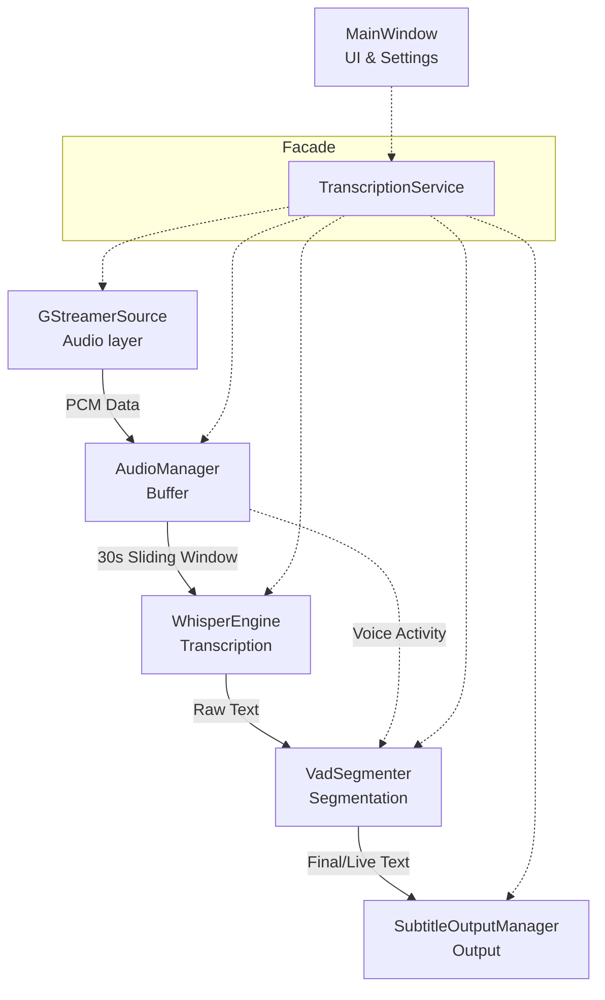

# Live Captions

A real-time system audio transcription overlay for Windows, built with .NET 8, Whisper.net, and GStreamer.

## Features

- Captures system audio (speaker loopback) and **optional Microphone input** in real-time via GStreamer
- Transcribes using OpenAI Whisper (`tiny.en` or custom models) with **Vulkan GPU Acceleration** and multi-thread CPU fallback
- **Spoken Language Selection**: Auto-detect, English, or Korean support
- Overlay window always on top, pinned to all virtual desktops, and seamlessly draggable
- **Dynamic Multi-line Subtitle Rendering**: Automatically scales from 2 up to 10 lines depending on window height
- **Block-level subtitle rendering**: Line 1 freezes for readability, Line 2 fills and snaps upwards
- **Smart Filtering**: Profanity filter, audio tag toggle (e.g., `[music]`), and hallucination/duplicate prevention
- **Customizable Appearance**: 5 built-in themes (Default, White on Black, Small Caps, Large Text, Yellow on Blue) and 8 layout snap positions
- Natural sentence segmentation via VAD silence detection (800ms timer)
- Translation-ready output layer (`ITranslator` hook)

---

## Architecture

The codebase is organized into clean, separated layers:


```mermaid
flowchart TD
    G[GStreamerSource\nAudio layer] -->|PCM Data| A[AudioManager\nBuffer]
    A -->|30s Sliding Window| W[WhisperEngine\nTranscription]
    W -->|Raw Text| V[VadSegmenter\nSegmentation]
    A -.->|Voice Activity| V
    V -->|Final/Live Text| S[SubtitleOutputManager\nOutput]
    
    subgraph Facade
    T[TranscriptionService]
    end
    T -.-> G
    T -.-> A
    T -.-> W
    T -.-> V
    T -.-> S
    
    UI[MainWindow\nUI & Settings] -.-> T
```

| Layer | Files | Responsibility |
|---|---|---|
| **UI & Settings** | `MainWindow.cs`<br>`AppSettingsManager.cs`<br>`Preferences.cs` | Handles the draggable borderless UI, inline settings dropdown, theme application, window positioning, and persisting user preferences. |
| **Audio Source** | `Audio/IAudioResource.cs`<br>`Audio/GStreamerSource.cs` | GStreamer pipeline — captures loopback audio (and optionally mic) at 16 kHz mono S16LE. |
| **Audio Buffer** | `Audio/AudioManager.cs` | Chunks PCM into 0.25 s blocks, maintains up to a 30 s safety rolling buffer (sliding window), tracks voice activity. |
| **Transcription** | `Transcription/ITranscriptionEngine.cs`<br>`Transcription/WhisperEngine.cs` | Runs Whisper inference on session snapshot, optimized with Vulkan GPU support and multithreading. |
| **Segmentation** | `Segmentation/ISentenceSegmenter.cs`<br>`Segmentation/VadSegmenter.cs` | Runs inference loop. Emits `isFinal=true` to slide the window on natural boundaries using silence pause limits. |
| **Output** | `Output/IOutputManager.cs`<br>`Output/SubtitleOutputManager.cs` | Processes text into frozen reading blocks, handling up to 10 lines dynamically. Smoothly rolls text up and prevents text flickering. |
| **Facade** | `TranscriptionService.cs` | Wires all layers together; provides a unified API for the application. |

---

## Subtitle Display & Sliding Window

The captioning engine replicates the **Windows Live Captions sliding window** behaviour:

1. **Continuous Speech:** As you speak, the audio buffer grows (up to 30 seconds), allowing Whisper to retain context.
2. **Natural Boundaries:** When you naturally pause for a breath, the app commits the text to the UI, clears the buffer, and seamlessly "slides" the window forward for the next sentence.
3. **Safety Nets:** If you speak continuously for 10 seconds, the window safely slides forward to prevent high latency.

### Block-Level Display Snapping & Dynamic Layout

The rendering engine is built for maximum readability by preventing text from smoothly sliding horizontally:

1. The UI dynamically detects the window height and generates between **2 and 10 visible text lines**.
2. Words fill the bottom-most available line left-to-right.
3. Once a line dynamically reaches the right edge, it **freezes** in place perfectly solid.
4. When the bottom line is full, all lines instantly **snap upwards** by one row, pushing the oldest line off-screen.
5. The layout algorithm actively prevents overlap duplicate words, prevents top-line flickering during Whisper mid-sentence corrections, and cleans up hallucinated noise seamlessly.

## Settings & Preferences

Click the **⚙ (Gear) icon** to access the inline settings menu:
- **Include Microphone**: Mixes default system audio with microphone input.
- **Filter Profanity**: Censors recognized profanity with `***`.
- **Show Audio Tags**: Toggles Whisper's ambient tags like `(applause)` or `[music]`.
- **Caption Style**: Instantly swap between visual themes.
- **Window Position**: Snap the overlay to standard screen edges/corners.
- **Spoken Language**: Choose `Auto-Detect`, `English`, or `Korean`.

Settings and window bounds are automatically saved to `%APPDATA%\LiveCaptions\settings.json`.

---

## Prerequisites

- **Windows 10/11**
- **.NET 8 SDK** — [download](https://dotnet.microsoft.com/download/dotnet/8.0)
- **GStreamer 1.x** (MinGW 64-bit) — [download](https://gstreamer.freedesktop.org/download/)
  - Required plugins: `wasapi2src`, `audioconvert`, `audioresample`, `appsink`
  - Set environment variable: `GSTREAMER_1_0_ROOT_MINGW_X86_64` → your GStreamer install path

---

## Build & Run

```bash
# Build
dotnet build -r win-x64

# Run (downloads tiny model on first launch ~74 MB)
dotnet run -r win-x64
```

---

## Extensibility

### Add a new audio source
Implement `IAudioResource` (e.g. `MicSource`, `FileSource`) and pass it to `AudioManager.Attach()`.

### Add translation
Implement `Output.ITranslator` and set it on the output manager:

```csharp
outputManager.Translator = new MyTranslator(targetLanguage: "ta");
```

### Model Choice

| Model | Size | Speed (Vulkan/GPU) | Accuracy |
|---|---|---|---|
| `tiny.en` / `tiny` | ~74 MB | ~0.1–0.2 s/read | Good (Ultra-Low Latency) |
| `base.en` | ~142 MB | ~0.2–0.4 s/read | Better |
| `large-v3-turbo` | ~3.02 GB | Fast | Excellent (Near Human) |

`tiny` is the default for instant real-time use. It automatically downloads on the first run.
