# Live Captions

A real-time speech-to-text subtitle overlay for Windows, similar to Windows Live Captions, built using OpenAI Whisper and GStreamer.

## 🚀 Overview

Captures system audio (loopback) or microphone in real-time, transcribes it using the Whisper (`base.en`) model via a **sliding window approach**, and displays the result in a clean 2-line subtitle overlay that is always on top and pinned across all virtual desktops.

Words appear live as you speak — not in chunks — just like Windows Live Captions.

## ✨ Features

- **Live word-by-word transcription** — 0.25s audio chunks with sliding window for near-instant display
- **2-line subtitle display** — older sentence dims and shifts to line 1, new text appears on line 2
- **Voice Activity Detection (VAD)** — detects silence (1.2s threshold) to commit and reset sentences
- **Session buffer cap** — capped at 5 seconds to keep Whisper inference fast throughout
- **Busy-skip guard** — when Whisper is processing, incoming audio merges into buffer instead of queuing
- **Sound visualizer** — animated 3-bar EQ indicator that responds to audio levels
- **Always-on-top overlay** — semi-transparent, borderless WPF window
- **Pinned to all virtual desktops** — visible across all Win+Tab desktops
- **No full-screen** — window cannot be maximized
- **Auto model download** — downloads Whisper model on first run
- **Loopback capture** — transcribes system speaker audio by default

## 🏗 Architecture

```mermaid
graph TD
    A["GStreamer: wasapi2src (loopback=true)"] --> B[audioconvert]
    B --> C[audioresample → 16kHz Mono S16LE]
    C --> D[appsink]
    D --> E["0.25s Audio Chunks"]
    E --> F["Session Buffer (max 5s)"]
    F --> G["Whisper.net base.en Processor"]
    G --> H["WPF 2-Line Subtitle UI"]
    I[ModelDownloader] -.->|base.en.bin| G
    E --> J["Voice Activity Detection"]
    J -->|silence > 1.2s| K["Commit sentence → line1, clear buffer"]
    J -->|active| L["Live update line2"]
```



### Core Components

1. **Audio Pipeline (`TranscriptionService.cs`)**
   - Captures audio via `wasapi2src` with `loopback=true` (system speaker output)
   - GStreamer pipeline: `wasapi2src ! audioconvert ! audioresample ! appsink`
   - Resamples to **16kHz Mono 16-bit PCM** (S16LE) — required by Whisper
   - Chunks audio every **0.25 seconds** for low-latency processing
   - Accumulates chunks into a **session buffer** (max 5 seconds)
   - Wraps raw PCM in a WAV/RIFF header before submitting to Whisper

2. **Transcription Engine (Whisper.net)**
   - Uses `whisper.cpp` via the `Whisper.net` 1.7.0 NuGet package
   - Model: **`base.en`** (~148 MB, balanced accuracy/speed, English-only)
   - `ModelDownloader` downloads the model automatically on first launch
   - Runs on a background task; a `_isBusy` guard prevents queue buildup

3. **Voice Activity Detection**
   - Audio level calculated per 0.25s chunk (peak of S16LE samples)
   - If peak level > 5% (`0.05f`), timestamp is updated as "voice active"
   - After **1.2 seconds of silence**, the current transcription is **committed** (pushed to line 1) and the session buffer is cleared
   - After **2 seconds of silence with no speech**, buffer is also cleared

4. **WPF Overlay UI (`Program.cs`)**
   - 2-line display: `line1Block` (dimmed gray) for the previous sentence, `line2Block` (bright white) for live text
   - Borderless, transparent WPF window — no XAML (avoids `MC3074` build errors)
   - Positioned at the **bottom of the primary monitor** on startup
   - **Pinned to all virtual desktops** via `IVirtualDesktopManager` COM API
   - **No maximize/full-screen** — blocked via `StateChanged` event handler
   - Draggable from anywhere on the window body
   - Animated sound EQ bars respond to real-time audio levels

## 🛠 Tech Stack

| Component      | Technology                            |
|----------------|---------------------------------------|
| Framework      | .NET 8.0 (`net8.0-windows`, `win-x64`)|
| UI             | WPF (pure C#, no XAML)                |
| Audio Capture  | GStreamer 1.x via `GstSharpBundle`    |
| Speech-to-Text | Whisper.net 1.7.0 (`whisper.cpp`)     |
| Model          | `base.en` (~148 MB)                   |
| Build System   | GNU Make + dotnet CLI                 |

## 📦 Prerequisites

1. **[.NET 8.0 SDK](https://dotnet.microsoft.com/download/dotnet/8.0)**
2. **GStreamer Runtime** — Install via winget:
   ```bash
   winget install gstreamerproject.gstreamer
   ```
   Then add to your system `PATH`:
   ```
   C:\Program Files\gstreamer\1.0\msvc_x86_64\bin
   ```
   Verify installation:
   ```bash
   gst-inspect-1.0 --version
   gst-inspect-1.0 wasapi2src
   ```

## 🔨 Build & Run

```bash
# Build
make build

# Run (downloads base.en model on first launch, ~148 MB)
make run

# Clean build artifacts
make clean

# Full rebuild from scratch
make full-rebuild
```

### Manual Commands
```bash
dotnet restore -r win-x64
dotnet build -r win-x64
dotnet run --no-build -r win-x64
```

## 🎛 Configuration Reference

| Parameter | Value | Description |
|---|---|---|
| `ChunkSize` | `16000 * 2 / 4` | 0.25s chunks of audio per signal |
| `MinSessionBytes` | `16000 * 2 * 1` | 1 second min before first inference |
| `MaxSessionBytes` | `16000 * 2 * 5` | 5 second max session buffer |
| Silence threshold | `0.05f` (5%) | Below this → no voice activity |
| VAD commit timeout | `1.2s` | Silence to commit current sentence |
| Buffer clear timeout | `2.0s` | Silence to fully clear session buffer |
| Model | `base.en` | Whisper base model, English-only |

## 📝 Troubleshooting

- **First launch**: The `base.en` Whisper model (~148 MB) is downloaded automatically on first run.
- **Slow transcription**: If text still lags, consider switching to `tiny.en` (~74 MB) in `Program.cs` → `EnsureModelExists("tiny.en")`.
- **GStreamer path**: Detected automatically from `C:\Program Files\gstreamer\1.0\msvc_x86_64\bin`. `GST_PLUGIN_PATH` is set automatically at startup.
- **Virtual desktops**: Window stays visible across all Windows virtual desktops (Win+Tab).
- **Crash log**: A `crash_log.txt` is written to the app directory on fatal startup errors.
- **No audio**: Make sure your default audio device is set and GStreamer can access it.

## 🐛 GStreamer Debugging Guide

1. **Test Pipeline via CLI**
   ```bash
   # Test system audio (loopback) capture
   gst-launch-1.0 wasapi2src loopback=true num-buffers=100 ! fakesink dump=true

   # Test microphone capture
   gst-launch-1.0 wasapi2src num-buffers=100 ! fakesink dump=true
   ```

2. **Inspect Element Properties**
   ```bash
   gst-inspect-1.0 wasapi2src
   ```

3. **Common Issues**
   - **No system audio**: Set `loopback=true` on `wasapi2src` to capture speaker output instead of microphone.
   - **OverflowException in PCM**: Always cast `short` to `int` before calling `Math.Abs()` to avoid overflow at -32768.
   - **Plugin loader warning**: The `External plugin loader failed` warning is harmless — it's a `GstSharpBundle` issue with the scanner helper binary.
   - **Pipeline not starting**: Check the return value of `_pipeline.SetState(State.Playing)` — it should be `Success` or `Async`.
